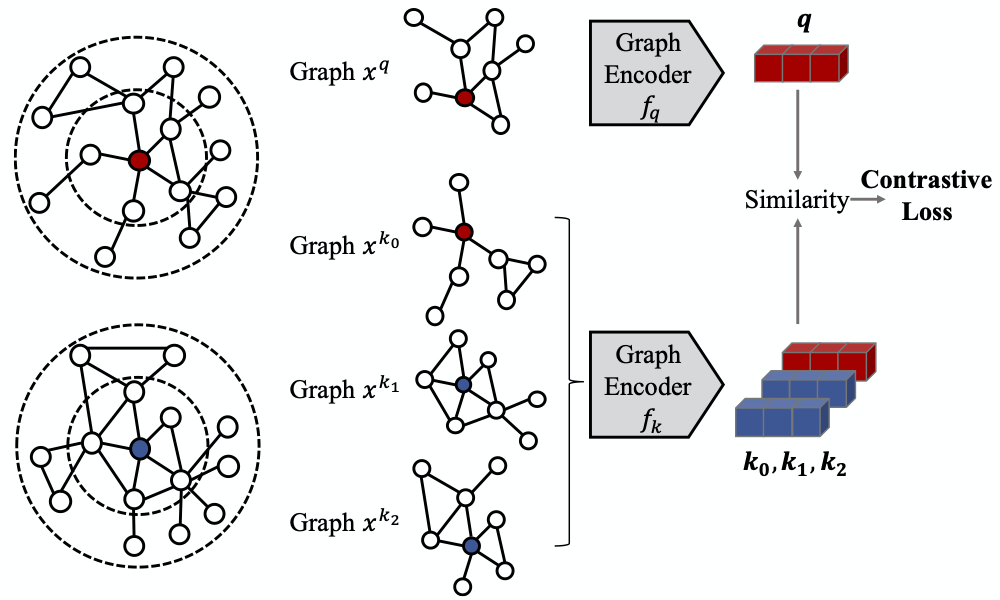

<p align="center">
  
  <br />
  <br />
  <a href="https://github.com/THUDM/GCC/blob/master/LICENSE"></a>
  <a href="https://github.com/ambv/black"></a>
</p>

-------------------------------------

# GCC: Graph Contrastive Coding for Graph Neural Network Pre-Training

Original implementation for paper [GCC: Graph Contrastive Coding for Graph Neural Network Pre-Training](https://arxiv.org/abs/2006.09963).

GCC is a **contrastive learning** framework that implements unsupervised structural graph representation pre-training and achieves state-of-the-art on 10 datasets on 3 graph mining tasks.

- [GCC: Graph Contrastive Coding for Graph Neural Network Pre-Training](#gcc-graph-contrastive-coding-for-graph-neural-network-pre-training)
  - [Installation](#installation)
    - [Requirements](#requirements)
  - [Quick Start](#quick-start)
    - [Pretraining](#pretraining)
      - [Pre-training datasets](#pre-training-datasets)
      - [E2E](#e2e)
      - [MoCo](#moco)
      - [Download Pretrained Models](#download-pretrained-models)
    - [Downstream Tasks](#downstream-tasks)
      - [Downstream datasets](#downstream-datasets)
      - [Node Classification](#node-classification)
        - [Unsupervised (Table 2 freeze)](#unsupervised-table-2-freeze)
        - [Supervised (Table 2 full)](#supervised-table-2-full)
      - [Graph Classification](#graph-classification)
        - [Unsupervised (Table 3 freeze)](#unsupervised-table-3-freeze)
        - [Supervised (Table 3 full)](#supervised-table-3-full)
      - [Similarity Search (Table 4)](#similarity-search-table-4)
  - [❗ Common Issues](#-common-issues)
  - [Citing GCC](#citing-gcc)
  - [Acknowledgements](#acknowledgements)

## Installation

### Requirements

- Linux with Python ≥ 3.6
- [PyTorch ≥ 1.4.0](https://pytorch.org/)
- [0.5 > DGL ≥ 0.4.3](https://www.dgl.ai/pages/start.html)
- `pip install -r requirements.txt`
- Install [RDKit](https://www.rdkit.org/docs/Install.html) with `conda install -c conda-forge rdkit=2019.09.2`.

## Quick Start

<!--
## How to process data

```
python x2dgl.py --graph-dir data_bin/kdd17 --save-file data_bin/dgl/graphs.bin
```
-->

### Pretraining

#### Pre-training datasets

```bash
python scripts/download.py --url https://drive.google.com/open?id=1JCHm39rf7HAJSp-1755wa32ToHCn2Twz --path data --fname small.bin
# For regions where Google is not accessible, use
# python scripts/download.py --url https://cloud.tsinghua.edu.cn/f/b37eed70207c468ba367/?dl=1 --path data --fname small.bin
```

#### E2E

Pretrain E2E with `K = 255`:

```bash
bash scripts/pretrain.sh <gpu> --batch-size 256
```

#### MoCo

Pretrain MoCo with `K = 16384; m = 0.999`:

```bash
bash scripts/pretrain.sh <gpu> --moco --nce-k 16384
```

#### Download Pretrained Models

Instead of pretraining from scratch, you can download our pretrained models.

```bash
python scripts/download.py --url https://drive.google.com/open?id=1lYW_idy9PwSdPEC7j9IH5I5Hc7Qv-22- --path saved --fname pretrained.tar.gz
# For regions where Google is not accessible, use
# python scripts/download.py --url https://cloud.tsinghua.edu.cn/f/cabec37002a9446d9b20/?dl=1 --path saved --fname pretrained.tar.gz
```

### Downstream Tasks

#### Downstream datasets

```bash
python scripts/download.py --url https://drive.google.com/open?id=12kmPV3XjVufxbIVNx5BQr-CFM9SmaFvM --path data --fname downstream.tar.gz
# For regions where Google is not accessible, use
# python scripts/download.py --url https://cloud.tsinghua.edu.cn/f/2535437e896c4b73b6bb/?dl=1 --path data --fname downstream.tar.gz
```

Generate embeddings on multiple datasets with

```bash
bash scripts/generate.sh <gpu> <load_path> <dataset_1> <dataset_2> ...
```

For example:

```bash
bash scripts/generate.sh 0 saved/Pretrain_moco_True_dgl_gin_layer_5_lr_0.005_decay_1e-05_bsz_32_hid_64_samples_2000_nce_t_0.07_nce_k_16384_rw_hops_256_restart_prob_0.8_aug_1st_ft_False_deg_16_pos_32_momentum_0.999/current.pth usa_airport kdd imdb-binary
```

#### Node Classification

##### Unsupervised (Table 2 freeze)

Run baselines on multiple datasets with `bash scripts/node_classification/baseline.sh <hidden_size> <baseline:prone/graphwave> usa_airport h-index`.

Evaluate GCC on multiple datasets:

```bash
bash scripts/generate.sh <gpu> <load_path> usa_airport h-index
bash scripts/node_classification/ours.sh <load_path> <hidden_size> usa_airport h-index
```

##### Supervised (Table 2 full)

Finetune GCC on multiple datasets:

```bash
bash scripts/finetune.sh <load_path> <gpu> usa_airport
```

Note this finetunes the whole network and will take much longer than the freezed experiments above.

#### Graph Classification

##### Unsupervised (Table 3 freeze)

```bash
bash scripts/generate.sh <gpu> <load_path> imdb-binary imdb-multi collab rdt-b rdt-5k
bash scripts/graph_classification/ours.sh <load_path> <hidden_size> imdb-binary imdb-multi collab rdt-b rdt-5k
```

##### Supervised (Table 3 full)

```bash
bash scripts/finetune.sh <load_path> <gpu> imdb-binary
```

#### Similarity Search (Table 4)

Run baseline (graphwave) on multiple datasets with `bash scripts/similarity_search/baseline.sh <hidden_size> graphwave kdd_icdm sigir_cikm sigmod_icde`.

Run GCC:

```bash
bash scripts/generate.sh <gpu> <load_path> kdd icdm sigir cikm sigmod icde
bash scripts/similarity_search/ours.sh <load_path> <hidden_size> kdd_icdm sigir_cikm sigmod_icde
```

## ❗ Common Issues

<details>
<summary>
"XXX file not found" when running pretraining/downstream tasks.
</summary>
<br/>
Please make sure you've downloaded the pretraining dataset or downstream task datasets according to GETTING_STARTED.md.
</details>

<details>
<summary>
Server crashes/hangs after launching pretraining experiments.
</summary>
<br/>
In addition to GPU, our pretraining stage requires a lot of computation resources, including CPU and RAM. If this happens, it usually means the CPU/RAM is exhausted on your machine. You can decrease `--num-workers` (number of dataloaders using CPU) and `--num-copies` (number of datasets copies residing in RAM). With the lowest profile, try `--num-workers 1 --num-copies 1`.

If this still fails, please upgrade your machine :). In the meanwhile, you can still download our pretrained model and evaluate it on downstream tasks.
</details>

<details>
<summary>
Having difficulty installing RDKit.
</summary>
<br/>
See the P.S. section in [this](https://github.com/THUDM/GCC/issues/12#issue-752080014) post.
</details>

## Citing GCC

If you use GCC in your research or wish to refer to the baseline results, please use the following BibTeX.

```
@article{qiu2020gcc,
  title={GCC: Graph Contrastive Coding for Graph Neural Network Pre-Training},
  author={Qiu, Jiezhong and Chen, Qibin and Dong, Yuxiao and Zhang, Jing and Yang, Hongxia and Ding, Ming and Wang, Kuansan and Tang, Jie},
  journal={arXiv preprint arXiv:2006.09963},
  year={2020}
}
```

## Acknowledgements

Part of this code is inspired by Yonglong Tian et al.'s [CMC: Contrastive Multiview Coding](https://github.com/HobbitLong/CMC).
